# Branches

This section will explain you how to work with branch

## What is a branch ?

A `branch` is a separated line of developpement in a project Git. Think of it has parrallel version of the project. 

Fork is very clear with this because on the pages `All commits`, you will see clearly branches on the commits. For exemple :

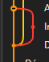

Here you have three branches

You have to create a branch every time you will develop a new feature, and delete it when the feature is done and you have pull it to the branch `QA`

## Warning

In the start of the project with already have 2 branchs. `Master` and `QA`. **NEVER WORK ON MASTER**, and avoid work on QA. 

When cloning you will be by default on the branch `Master`, you can see it below `Branches` on the left

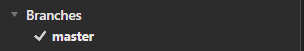

So the first thing to do is to change branch to `QA`, you need to `checkout` to the branch `QA`

## Switch branch (checkout)

For checkout to another branch go to the left of your screen

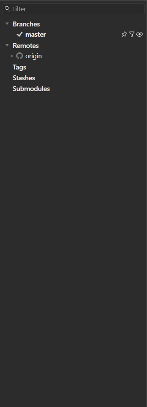

Below `Remote`, deploy the list `Origin`

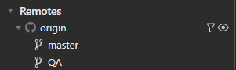

Right click on `QA` and select `checkout origin/QA`

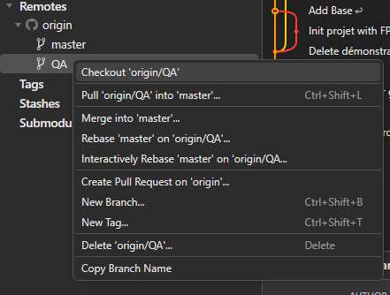

Now hit `Track`

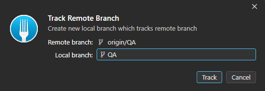

Now you can see that you have change branches

Congratulation now you have `Track` the branch `QA` into your local machine and fork have automatically `Checkout` you on it. If you want to change again to another branch that you already `Track` on your local machine

Go to `Branches`

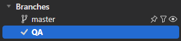

Right click on the branch you want to `checkout` and click on `checkout 'branch_name'`

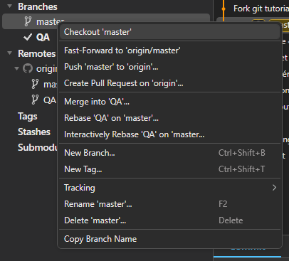

(**WARNING** this is juste an exemple **NEVER** checkout the branche `Master`)

## Create new branches

Now, when you will create a new branch for your new feature you have to follow this process.

First, all the branches must be created from the branch `QA`, so checkout on `QA` branch first

When you are on `QA` branch, go to the top middle and hit the button `Branch` with a `+`

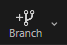

This window will open

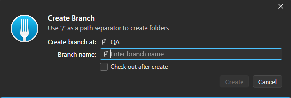

Enter the name of the new branch, you can check the option `check out after create`, if you want to automatically checkout to this branche

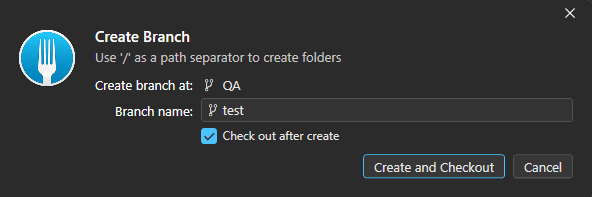

now hit `Create and Checkout`

Now you can see your new branch on the left and start working on it

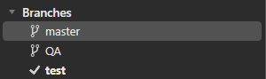

When you will `push` your work for the first time after created your branch this will happen ( you will understand this in the `Workflow` part)

you can keep it by default and just hit `Push`

Congratulations you understand how to start working with branches

# Next Section

That is the end of this section, now you can go to the next [section](../PullRequest/PullRequest.md)