# Configuration

In this section, i will explain you how to download and config Fork and Git

## Download

### Download Fork

Hit this [hyperlink](https://cdn.fork.dev/win/Fork-2.12.2.exe)

### Download Git

Hit this [hyperlink](https://github.com/git-for-windows/git/releases/download/v2.51.2.windows.1/Git-2.51.2-64-bit.exe)

## Install

### Install Fork

First you will see this

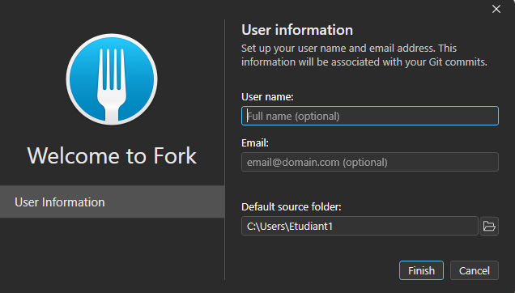

Enter your Github username, your email link to your Github account and the folder where Fork will put your Git Folder.

Personnaly I put it here C:\Users\\%USERPROFILE%\Documents\Github, simply in your folder Document, in a sub folder " GitHub ", but you can put it where you want.

For exemple :

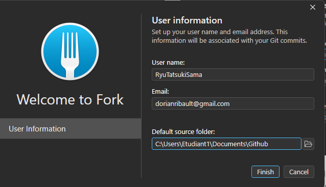

Good job, Fork will launch after that.

### Install Git

The installer will open, hit the button next

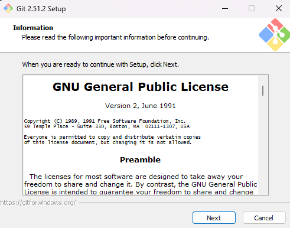

Now the git location, keep it by default, hit next

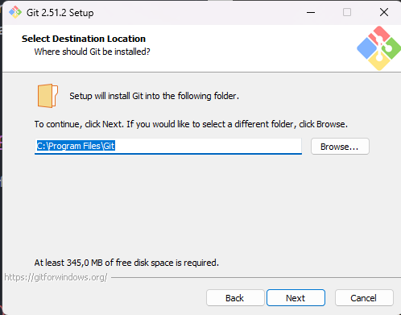

Check those options, these are the default option, if you want you can check more, but at minimal, keep those below.

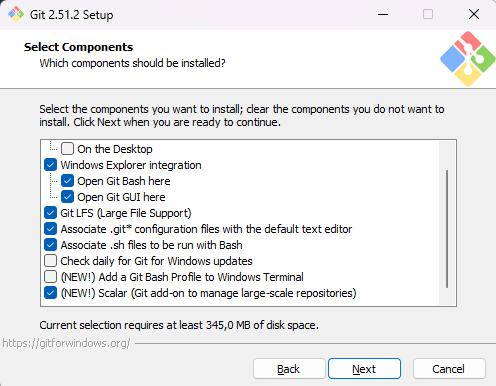

Next again

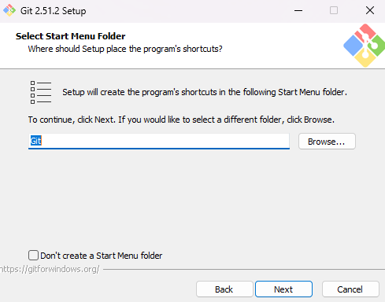

Now, for git editing, keep it by default for the artist. The developper, choose the one you want. Personnaly, it will be VS Code

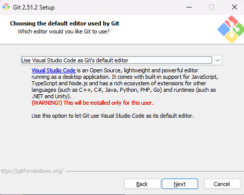

Press next for all the window below

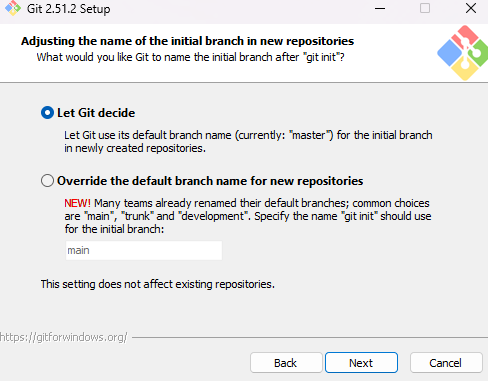

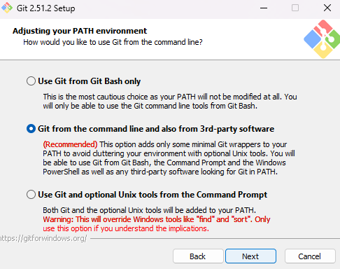

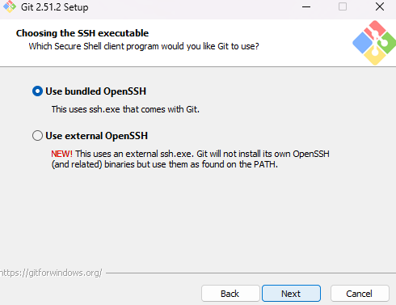

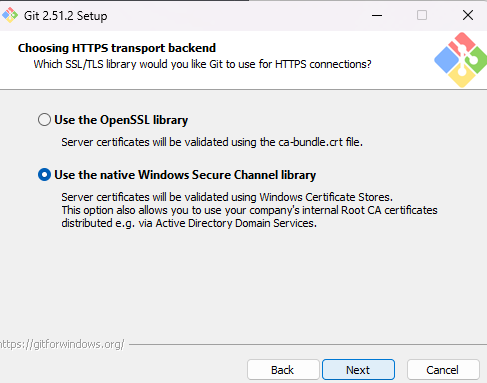

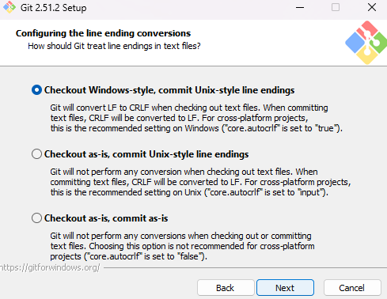

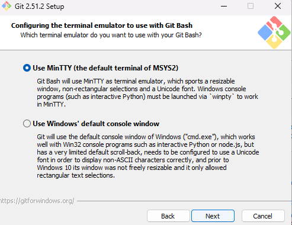

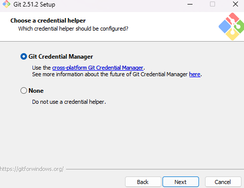

Finally hit install

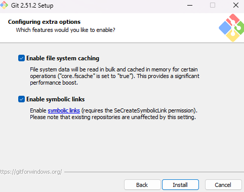

If you have the image below, it's all good, you can it finis

# Next section

This is the end of this part, you can go to the next one [here](../Introduction/Introduction.md)
