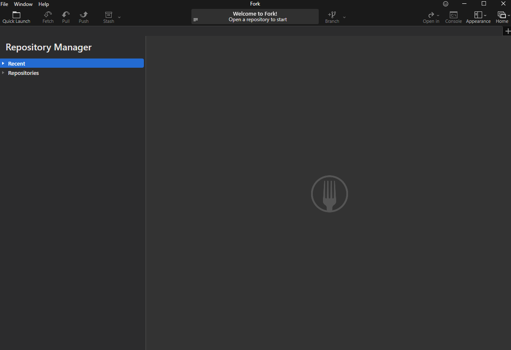
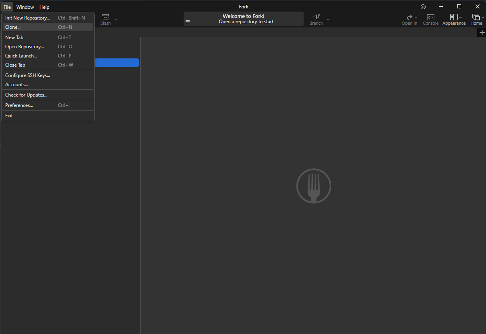
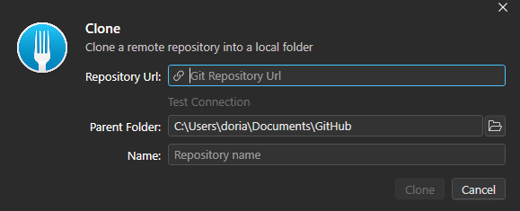
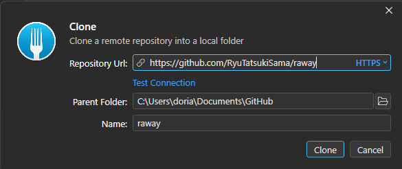
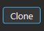

# Introduction

In this section, i will present you Fork.

## Precision

One thing important the difference between Git, Fork and GitHub

Git is the tool for exchange file (to simplify), like SVN, you use it with command line

Fork is a Git client to use it more easly, like TortoiseSVN.

Github is a platform where you can host Git folder, or Git Repo. For svn, it's the server of Creajeux that is the equivalent to Github

## Get the repo (or clone the repo)

This is the equivalent of " checkout " in SVN, see more [here](../GitvsSVN/GitvsSVN.md)

After installing Fork and open it you will see this

Go to the top left -> file -> clone...

A new window will open

Copy this link https://github.com/RyuTatsukiSama/raway, this is the link of the repo git

Now past it into, repository URL (Fork will automatically do it, but just in case)

Parent folder will be the folder where your repo folder will be (by default the folder you choose during the installation)

Name, will be the name of the repo folder (by default the name of the repo)

Now hit the button clone

