# Introduction

In this section, i will present you Fork.

## Precision

One thing important the difference between Git, Fork and GitHub

Git is the tool for exchange file (to simplify), like SVN, you use it with command line

Fork is a Git client to use it more easly, like TortoiseSVN.

Github is a platform where you can host Git folder, or Git Repo. For svn, it's the server of Creajeux that is the equivalent to Github

## Get the repo (or clone the repo)

This is the equivalent of " checkout " in SVN, see more [here](../GitvsSVN/GitvsSVN.md)

After installing Fork and open it you will see this

Go to the top left -> file -> clone...

A new window will open

Copy this link https://github.com/RyuTatsukiSama/raway, this is the link of the repo git

Now past it into, repository URL (Fork will automatically do it, but just in case)

Parent folder will be the folder where your repo folder will be (by default the folder you choose during the installation)

Name, will be the name of the repo folder (by default the name of the repo)

Now hit the button clone

Now wait for the clone to be done

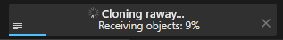

After you will see this or something similar

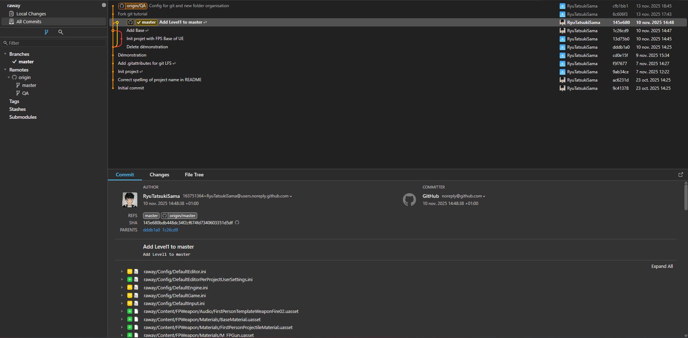

Congratulations, you have the project with you !

## Interface Presentation

### All Commits

First, we are in the Windows " All Commits ", you can see it on the left

First you have the tree of the commit

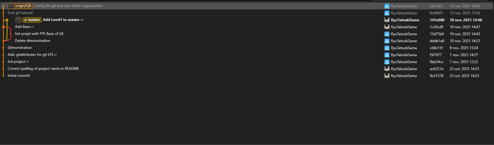

It is the list of all the commits, with the branch. You can select a commit and see more information about it below (by default the last commit is selected)

Below you have three tab. First, the commit. It contain all the informations about the commit

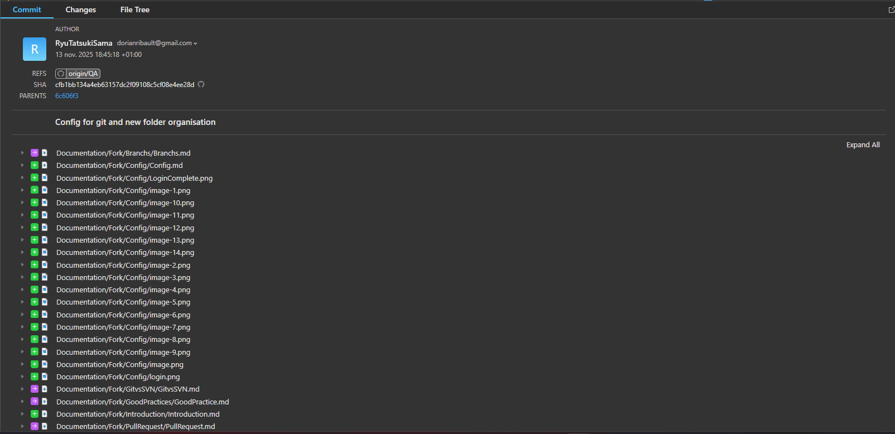

Author of the commit, date, the branch, the id of the commit (SHA), the parent commit, the message of the commit and the file change

After you have the tab changes

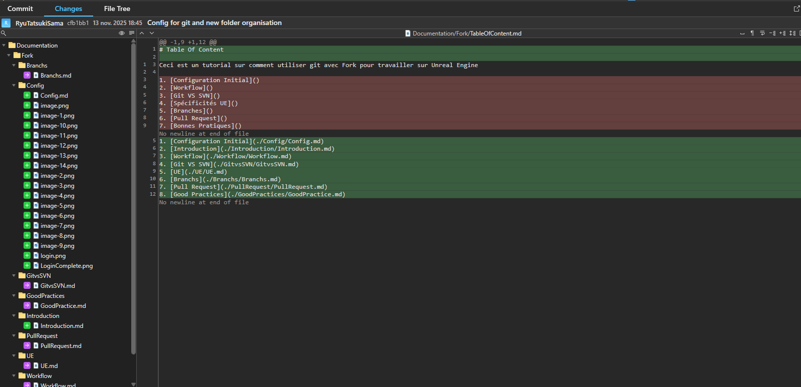

just a more clean way to see the changes of the files

And in third the file tree

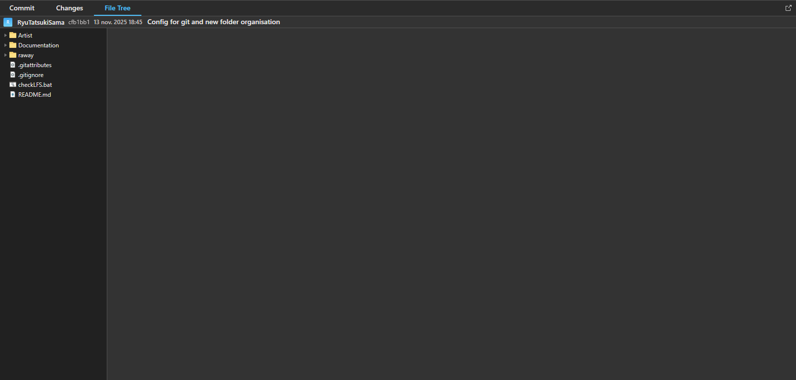

It is the state of the file tree after the commit has been done

### Local Changes

You can select it on the left, just above the " all commits "

**Warning** : This part is hardly link to the [Workflow](../Workflow/Workflow.md) section. If you don't understand key words, don't worry the section Workflow will explain them to you

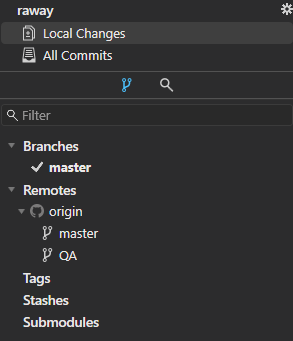

You will see this

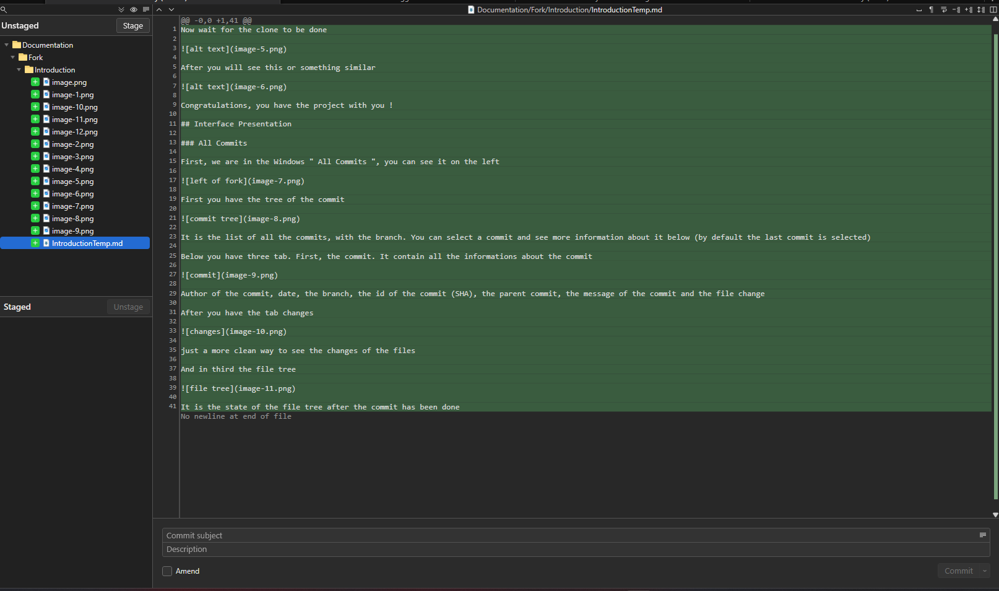

First you have the Unstaged

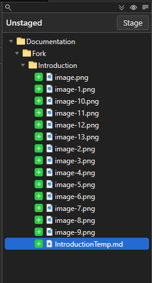

That all the file that are not add (unstaged) to your next commit

Below you have the Staged tab

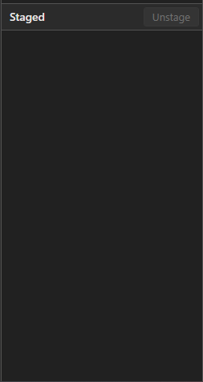

That all the file that are add (staged) to your next commit

In big at the center you have the Change tab

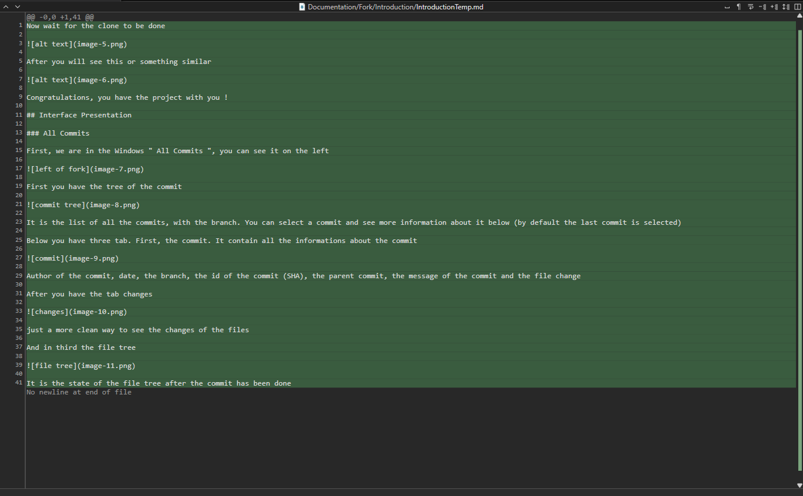

You will se this what changed in your file

And finnaly the message tab

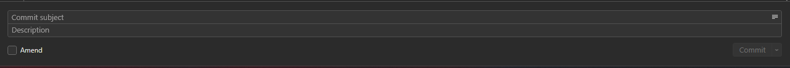

Here you can put the Commit message (subject), the description and check or not the " amend " option

# Next Section

That is the end of this section, now you can go to the next [section](../Branchs/Branchs.md)