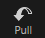
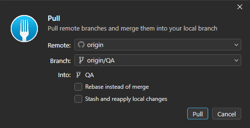
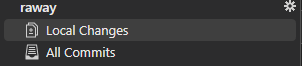

# Workflow

This section will explain you how to work daily with Fork

## Pull

**ALWAYS**, always `pull`. Equivalent to `update` in SVN.

At the top left of your screen in fork you have th button `Pull` click it

A new window will open

Keep all the options by default, this will pull from the branch you are currently in and just hit `Pull`

Now all the file are in your folder

## Staging

Now, you can start working. When you want to send your work, or keep a trace of it. You will need to Stage the new/modified file(s)

So go the the `local changes` window

## Commit 

## Push

## Diagram

# Next section